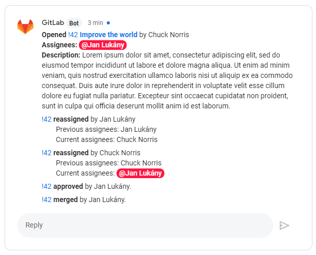

# Gitlab Google Chat Integration

A Python Flask web application that forwards webhook requests
from GitLab to Google Chat.



## How to run

`ggci` provides Flask application factory `create_app()`:

```python
from ggci import create_app

app = create_app()
```

## Configuration

By default `create_app()` looks for a YAML configuration file specified
by `GGCI_CONFIG` environment variable.
Example config:

```YAML
gitlab_token: xxxxxxx

google_chat_url: https://chat.googleapis.com/v1/spaces/...

user_mappings:  # OPTIONAL, used for mentions; key: GitLab ID, val: Google Chat ID
  5894317: 120984893489384029908  # Gandalf
  4985120: 109238409842809234892  # Chuck Norris
```

Alternatively, `create_app()` also accepts optional argument `config` of type
`ggci.Config`.

## Features

### Merge Request Events Notifications

Notifications for merge requests actions.
All notifications for one MR are posted to the same thread (identified
by merge request ID).
Supported actions:

- *open*: includes link with title, event author, mentions of assignees
  and description
- *approved*: includes event author
- *update of assigness*: includes event author, list of previous assigness
  and mentions of current assignees
- *merged*: includes action author
